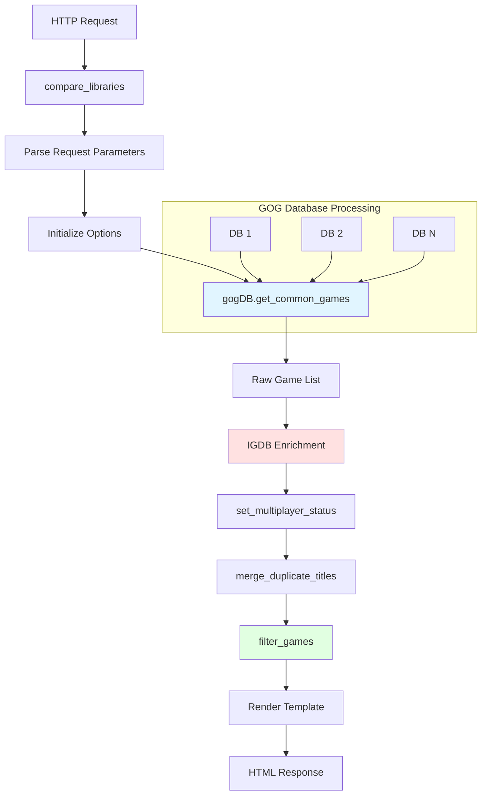

# compare_libraries Function Data Documentation

## Overview

This document describes the data structures and flow used by the `compare_libraries` function in Gamatrix. The function is a Flask route handler (`/compare`) that processes multiple GOG Galaxy databases, compares game ownership across users, and generates comparison results.

**Location**: `src/gamatrix/__main__.py` (lines 129-204)

**Purpose**: Compare game libraries between multiple users and present results in either a game list or grid format.

## High-Level Data Flow



## Input Data Structures

### 1. HTTP Request Parameters

The function receives data via HTTP GET/POST requests with the following parameters:

| Parameter | Type | Description | Example |
|-----------|------|-------------|---------|
| `option` | String | View type: `list`, `grid`, or `upload` | `"list"` |
| `{user_id}` | String | User IDs as keys (value is `"on"` when checked) | `"1234567": "on"` |
| `exclude_platform_{platform}` | String | Platforms to exclude | `"exclude_platform_epic": "on"` |
| `include_single_player` | Boolean | Include single-player games | `true` |
| `exclusive` | Boolean | Exclude games owned by non-selected users | `true` |
| `show_keys` | Boolean | Display release keys in output | `true` |
| `randomize` | Boolean | Pick one random game from results | `true` |

**Example Request**:
```http
GET /compare?option=list&1234567=on&8901234=on&exclude_platform_epic=on&include_single_player=on
```

### 2. Configuration Data

The `config` dictionary contains runtime configuration loaded from `config.yaml`:

```python
config = {
    "users": {
        1234567: {
            "username": "Alice",
            "db": "alice.db",
            "db_mtime": "2024-11-15 10:30:00",
            "cidrs": [IPv4Network("192.168.1.0/24")]
        },
        8901234: {
            "username": "Bob", 
            "db": "bob.db",
            "db_mtime": "2024-11-15 09:15:00",
            "cidrs": [IPv4Network("10.0.0.0/24")]
        }
    },
    "db_path": "/path/to/databases",
    "db_list": ["/path/to/databases/alice.db", "/path/to/databases/bob.db"],
    "hidden": ["slugified-title-to-hide"],  # Slugified titles to exclude
    "metadata": {
        "counter-strike-global-offensive": {
            "max_players": 10,
            "comment": "Custom note"
        }
    },
    "igdb_client_id": "your_client_id",
    "igdb_client_secret": "your_secret",
    "cache": ".cache.json",
    "update_cache": False,
    "allowed_cidrs": [IPv4Network("0.0.0.0/0")],
    "uploads_enabled": True,
    "all_games": False,
    "include_single_player": False,
    "installed_only": False
}
```

### 3. Options Dictionary

Created by `init_opts()` and populated from request parameters:

```python
opts = {
    "include_single_player": False,    # Include single-player games
    "exclusive": False,                 # Show only games NOT owned by non-selected users
    "show_keys": False,                # Display release keys in UI
    "randomize": False,                # Pick one random game
    "user_ids_to_compare": {           # Users selected for comparison
        1234567: {
            "username": "Alice",
            "db": "alice.db",
            # ... other user data
        }
    },
    "exclude_platforms": ["epic"]      # Platforms to exclude
}
```

## Core Data Structures

### 4. Game List Dictionary (Primary Data Structure)

The `game_list` dictionary is the central data structure, created by `gogDB.get_common_games()`:

```python
game_list = {
    "steam_730": {                              # Release key (primary identifier)
        "title": "Counter-Strike: Global Offensive",
        "slug": "counter-strike-global-offensive",
        "owners": [1234567, 8901234],          # User IDs who own this game
        "installed": [1234567],                 # User IDs who have it installed
        "platforms": ["steam"],                 # Platforms where game is available
        "igdb_key": "steam_730",               # Best key for IGDB API lookup
        "multiplayer": True,                    # Supports multiplayer (from IGDB/config)
        "max_players": 10,                      # Maximum players (from IGDB/config)
        "comment": "Custom note"                # Optional metadata from config
    },
    "gog_1207658924": {
        "title": "The Witcher 3: Wild Hunt",
        "slug": "the-witcher-3-wild-hunt",
        "owners": [1234567, 8901234, 5678901],
        "installed": [1234567, 5678901],
        "platforms": ["gog", "steam"],          # Multi-platform ownership merged
        "igdb_key": "steam_292030",            # Prefers Steam for IGDB lookup
        "multiplayer": False,
        "max_players": 1
    }
}
```

**Key Properties**:

- **Primary Key**: Release key (format: `{platform}_{game_id}`)
- **Sorting**: Ordered by slug, then by platform priority (Steam > GOG > others)
- **Owner Lists**: Always sorted numerically by user ID
- **Platform Merging**: Multiple entries for same game are consolidated

### 5. Release Key Format

Release keys uniquely identify a game on a specific platform:

```
Format: {platform}_{platform_game_id}

Examples:
- steam_730         (Counter-Strike on Steam)
- gog_1207658924    (The Witcher 3 on GOG)
- epic_catnip       (Game on Epic Games Store)
- xbox_12345        (Game on Xbox)
```

**Platform Priority for IGDB Lookup**:
1. Steam (best match rate: ~90%)
2. GOG (moderate match rate: ~50%)
3. Other platforms (low match rate)

### 6. IGDB Cache Structure

The cache stores IGDB API responses to minimize API calls:

```python
cache = {
    "igdb": {
        "access_token": "bearer_token_string",
        "token_expiry": 1699999999,
        "games": {
            "steam_730": {
                "igdb_id": 11370,
                "max_players": 10,
                "info": [{
                    "id": 11370,
                    "name": "Counter-Strike: Global Offensive",
                    "game_modes": [1, 2]  # IDs from constants.IGDB_GAME_MODE
                }]
            }
        }
    }
}
```

**IGDB Game Mode Constants** (from `helpers/constants.py`):
```python
IGDB_GAME_MODE = {
    "singleplayer": 1,
    "multiplayer": 2,
    "coop": 3,
    "splitscreen": 4,
    "mmo": 5,
    "battleroyale": 6
}

IGDB_MULTIPLAYER_GAME_MODES = [2, 3, 4, 5, 6]  # Non-single-player modes
```

## Data Transformation Pipeline

### Stage 1: Request Parsing (`compare_libraries`, lines 136-151)

```python
# Input: HTTP request parameters
# Output: opts dictionary

opts = init_opts()

for k in request.args.keys():
    try:
        i = int(k)
        # Numeric keys are user IDs
        opts["user_ids_to_compare"][i] = config["users"][i]
    except ValueError:
        if k.startswith("exclude_platform_"):
            platform = k.split("_")[-1]
            opts["exclude_platforms"].append(platform)
        else:
            opts[k] = True  # Boolean flags
```

**Input**: `request.args = {"1234567": "on", "8901234": "on", "exclude_platform_epic": "on"}`

**Output**: 
```python
opts = {
    "user_ids_to_compare": {1234567: {...}, 8901234: {...}},
    "exclude_platforms": ["epic"]
}
```

### Stage 2: Database Parsing (`gogDB.get_common_games()`)

This method iterates through each user's GOG database and builds the game list.

**Per Database Processing**:

1. **Extract User ID**:
   ```python
   userid = self.get_user()[0]  # Get user ID from Users table
   ```

2. **Get Owned Games**:
   ```python
   owned_games = self.get_owned_games()
   # Returns: [(release_keys, title_json), ...]
   # Example: [("steam_730,gog_12345", '{"title": "CS:GO"}'), ...]
   ```

3. **Get Installed Games**:
   ```python
   installed_games = self.get_installed_games()
   # Returns: ["steam_730", "gog_1207658924", ...]
   ```

4. **Build Game Entries**:
   ```python
   for release_keys, title_json in owned_games:
       for release_key in release_keys.split(","):
           platform = release_key.split("_")[0]
           
           if release_key not in game_list:
               title = json.loads(title_json)["title"]
               slug = get_slug_from_title(title)
               
               game_list[release_key] = {
                   "title": title,
                   "slug": slug,
                   "owners": [],
                   "installed": [],
                   "platforms": [platform],
                   "igdb_key": determine_best_igdb_key(release_key)
               }
           
           game_list[release_key]["owners"].append(userid)
           
           if release_key in installed_games:
               game_list[release_key]["installed"].append(userid)
   ```

**Key Filtering During Construction**:
- Null titles are skipped
- Hidden titles (in `config["hidden"]`) are skipped
- Excluded platforms are skipped
- Metadata from config is added if available

### Stage 3: IGDB Enrichment (`compare_libraries`, lines 166-178)

```python
for k in list(common_games.keys()):
    igdb_key = common_games[k]["igdb_key"]
    
    # Get IGDB ID (required for all other lookups)
    igdb.get_igdb_id(igdb_key) or 
    igdb.get_igdb_id_by_slug(igdb_key, common_games[k]["slug"], update_cache)
    
    # Get game info (name, modes, etc.)
    igdb.get_game_info(igdb_key)
    
    # Get multiplayer-specific info
    igdb.get_multiplayer_info(igdb_key)

cache.save()  # Persist IGDB data
```

**IGDB Lookup Process**:

1. **By Release Key**: Try exact match with IGDB's external games database
2. **By Slug**: Search by game name if exact match fails
3. **Fetch Game Info**: Get game modes, release dates, etc.
4. **Fetch Multiplayer Info**: Get max player count

### Stage 4: Multiplayer Status (`set_multiplayer_status`, lines 367-426)

Determines multiplayer support and max players with this precedence:

```python
def set_multiplayer_status(game_list, cache):
    for k in game_list:
        igdb_key = game_list[k]["igdb_key"]
        
        # Priority 1: Config file override
        if "max_players" in game_list[k]:
            max_players = game_list[k]["max_players"]
            multiplayer = max_players > 1
        
        # Priority 2: IGDB cache data
        elif igdb_key in cache["igdb"]["games"]:
            max_players = cache["igdb"]["games"][igdb_key]["max_players"]
            multiplayer = max_players > 1
        
        # Priority 3: Infer from IGDB game modes
        elif cache has game_modes:
            if game_modes == [SINGLEPLAYER_ONLY]:
                max_players = 1
                multiplayer = False
            elif any multiplayer mode in game_modes:
                multiplayer = True
                max_players = 0  # Unknown
        
        # Default: Unknown
        else:
            max_players = 0
            multiplayer = False
        
        game_list[k]["multiplayer"] = multiplayer
        game_list[k]["max_players"] = max_players
```

**Example Transformation**:

Before:
```python
"steam_730": {
    "title": "CS:GO",
    "igdb_key": "steam_730"
}
```

After:
```python
"steam_730": {
    "title": "CS:GO",
    "igdb_key": "steam_730",
    "multiplayer": True,
    "max_players": 10
}
```

### Stage 5: Duplicate Merging (`merge_duplicate_titles`, lines 282-351)

Consolidates multiple platform entries for the same game owned by the same users:

```python
# Before merging
game_list = {
    "steam_730": {
        "slug": "counter-strike-global-offensive",
        "owners": [1234567, 8901234],
        "platforms": ["steam"],
        "max_players": 10
    },
    "gog_12345": {
        "slug": "counter-strike-global-offensive",
        "owners": [1234567, 8901234],
        "platforms": ["gog"],
        "max_players": 10
    }
}

# After merging
game_list = {
    "steam_730": {
        "slug": "counter-strike-global-offensive",
        "owners": [1234567, 8901234],
        "platforms": ["gog", "steam"],  # Combined and sorted
        "max_players": 10
    }
    # gog_12345 entry removed
}
```

**Merge Logic**:
1. Sort by slug (alphabetically)
2. For consecutive games with same slug and same owners:
   - Merge platforms into first entry
   - Use highest max_players value
   - Delete duplicate entries
3. Keep separate entries if owners differ (different user subsets)

### Stage 6: Game Filtering (`filter_games`, lines 353-405)

Removes games that don't match search criteria:

```python
def filter_games(game_list, all_games=False):
    filtered_list = {}
    
    for k in game_list:
        # Remove single-player games (unless include_single_player)
        if not include_single_player and not game_list[k]["multiplayer"]:
            continue
        
        # If all_games mode, include everything else
        if all_games:
            filtered_list[k] = game_list[k]
            continue
        
        # Check all selected users own the game
        for owner in user_ids_to_compare:
            if owner not in game_list[k]["owners"]:
                break  # Skip this game
        else:
            # Check installation requirement
            if installed_only:
                for owner in user_ids_to_compare:
                    if owner not in game_list[k]["installed"]:
                        break  # Skip this game
                else:
                    # All checks passed
                    filtered_list[k] = game_list[k]
            else:
                filtered_list[k] = game_list[k]
        
        # Exclusive mode: remove if owned by excluded users
        if exclusive:
            for owner in user_ids_to_exclude:
                if owner in game_list[k]["owners"]:
                    del filtered_list[k]
                    break
    
    return filtered_list
```

**Filtering Criteria**:

| Filter | Effect | Example |
|--------|--------|---------|
| `include_single_player=False` | Remove games with `multiplayer=False` | Removes "The Witcher 3" |
| `all_games=True` | Show all games owned by any selected user | Shows union of all libraries |
| `all_games=False` | Show only common games | Shows intersection of libraries |
| `installed_only=True` | Require all users have it installed | Remove if any user hasn't installed |
| `exclusive=True` | Exclude if non-selected users own it | Remove shared with others |

**Example Filtering**:

Input:
```python
game_list = {
    "steam_730": {  # CS:GO
        "owners": [1234567, 8901234],
        "installed": [1234567],
        "multiplayer": True
    },
    "gog_1207658924": {  # Witcher 3
        "owners": [1234567],
        "installed": [1234567],
        "multiplayer": False
    }
}

# Selected users: [1234567, 8901234]
# Filters: include_single_player=False, installed_only=True
```

Output:
```python
game_list = {}  # Empty - CS:GO not installed by all, Witcher 3 is single-player
```

### Stage 7: Randomization (Optional)

If `randomize=True`, select one random game:

```python
if opts["randomize"]:
    key = random.choice(list(common_games))
    common_games = {key: common_games[key]}
```

## Output Data Structures

### Template Context (Game List View)

```python
template_context = {
    "games": {                          # Filtered game dictionary
        "steam_730": {
            "title": "Counter-Strike: Global Offensive",
            "slug": "counter-strike-global-offensive",
            "owners": [1234567, 8901234],
            "installed": [1234567],
            "platforms": ["steam"],
            "multiplayer": True,
            "max_players": 10,
            "comment": "Optional metadata"
        }
    },
    "users": {                          # Selected users
        1234567: {"username": "Alice"},
        8901234: {"username": "Bob"}
    },
    "caption": "2 games in common between Alice, Bob",
    "show_keys": False,
    "randomize": False,
    "platforms": ["steam", "gog", "epic", ...]  # All supported platforms
}
```

### Template Context (Game Grid View)

Same as Game List View, but `config["all_games"]` is forced to `True`, showing all games owned by any selected user instead of just common games.

## Data Examples

### Example 1: Two Users, Common Games

**Input**:
- User A (ID: 1111): Owns `steam_730` (CS:GO), `gog_1207658924` (Witcher 3)
- User B (ID: 2222): Owns `steam_730` (CS:GO), `epic_fortnite` (Fortnite)
- Selected users: [1111, 2222]
- Filters: `include_single_player=False`, `all_games=False`

**Processing**:

1. **After get_common_games()**:
```python
{
    "steam_730": {
        "title": "CS:GO",
        "owners": [1111, 2222],
        "installed": [1111],
        "multiplayer": True,
        "max_players": 10
    },
    "gog_1207658924": {
        "title": "Witcher 3",
        "owners": [1111],
        "multiplayer": False,
        "max_players": 1
    },
    "epic_fortnite": {
        "title": "Fortnite",
        "owners": [2222],
        "multiplayer": True,
        "max_players": 100
    }
}
```

2. **After filter_games()**:
```python
{
    "steam_730": {  # Only game owned by BOTH and is multiplayer
        "title": "CS:GO",
        "owners": [1111, 2222],
        "installed": [1111],
        "multiplayer": True,
        "max_players": 10
    }
}
```

**Output**: "1 games in common between User A, User B"

### Example 2: Platform Exclusion

**Input**:
- User owns `epic_fortnite` and `steam_730`
- Filter: `exclude_platforms=["epic"]`

**Processing**:

During `get_common_games()`, `epic_fortnite` is skipped:
```python
if platform in self.config["exclude_platforms"]:
    continue  # Skip epic_fortnite
```

**Output**: Only `steam_730` appears in results

### Example 3: Multi-Platform Ownership

**Input**:
- User owns both `steam_730` and `gog_12345` (both are CS:GO)

**Processing**:

1. **After get_common_games()**:
```python
{
    "steam_730": {
        "slug": "counter-strike-global-offensive",
        "platforms": ["steam"]
    },
    "gog_12345": {
        "slug": "counter-strike-global-offensive", 
        "platforms": ["gog"]
    }
}
```

2. **After merge_duplicate_titles()**:
```python
{
    "steam_730": {
        "slug": "counter-strike-global-offensive",
        "platforms": ["gog", "steam"]  # Merged
    }
}
```

## Data Validation and Edge Cases

### Null Titles

Some release keys have null titles in the GOG database:

```python
if title is None:
    log.debug(f"{release_key}: skipping as it has a null title")
    continue
```

**Effect**: Game is excluded from results

### Hidden Games

Games in `config["hidden"]` are filtered by slug:

```python
slug = get_slug_from_title(title)
if slug in self.config["hidden"]:
    continue
```

**Example**:
```yaml
# config.yaml
hidden:
  - "Counter-Strike: Global Offensive"  # Stored as slug: "counter-strike-global-offensive"
```

### Unknown Multiplayer Status

When IGDB has no data and config has no override:

```python
game_list[k]["multiplayer"] = False
game_list[k]["max_players"] = 0  # Unknown
```

**Effect**: Game is excluded if `include_single_player=False`

### Empty Results

If no games match criteria, an empty game list is displayed with caption "0 games in common between ...".

## Performance Considerations

### Database Iteration

Each database is processed sequentially:
- **Time Complexity**: O(n × m) where n = databases, m = average games per DB
- **Memory**: All games from all DBs held in memory simultaneously

### Sorting and Deduplication

```python
# Sorting: O(g log g) where g = total games across all DBs
ordered_game_list = {
    k: v for k, v in sorted(game_list.items(), key=cmp_to_key(self._sort))
}

# Merging: O(g) linear scan
```

### IGDB API Calls

- **Rate Limited**: Respects IGDB limits
- **Cached**: Responses stored in `.cache.json`
- **Batch**: One request per unique igdb_key
- **Optimization**: Prefers Steam keys (better match rate)

**Impact on First Run**: Can take ~1 second per game without cache

## Related Data Structures

### Configuration File Structure (`config.yaml`)

```yaml
db_path: "/path/to/databases"

users:
  1234567:
    username: "Alice"
    db: "alice.db"
    cidrs:
      - "192.168.1.0/24"

igdb_client_id: "your_id"
igdb_client_secret: "your_secret"

cache: ".cache.json"

hidden:
  - "Game Title to Hide"

metadata:
  "Game Title":
    max_players: 10
    comment: "Custom note"

allowed_cidrs:
  - "0.0.0.0/0"
```

### GOG Database Schema

See [GOG_DATABASE_SCHEMA.md](GOG_DATABASE_SCHEMA.md) for complete details on:
- Users table
- GamePieces table
- ProductPurchaseDates table
- InstalledProducts table
- Platform mappings

## Debugging Tips

### Enable Debug Logging

```bash
python -m gamatrix --server --debug
```

### Check Game List at Each Stage

Add logging after each transformation:

```python
log.debug(f"After get_common_games: {len(game_list)} games")
log.debug(f"After IGDB enrichment: {len(game_list)} games")
log.debug(f"After merge_duplicate_titles: {len(game_list)} games")
log.debug(f"After filter_games: {len(game_list)} games")
```

### Verify IGDB Cache

```bash
cat .cache.json | python -m json.tool
```

### Test Release Key Lookup

```python
from gamatrix.helpers.gogdb_helper import gogDB
gog = gogDB(config, opts)
gog.use_db("alice.db")
igdb_key = gog.get_igdb_release_key(type_id, "epic_fortnite")
print(f"Best IGDB key: {igdb_key}")
```

## Summary

The `compare_libraries` function orchestrates a complex data pipeline:

1. **Input**: HTTP request with user selections and filters
2. **Database Parsing**: Extract ownership and installation data from GOG DBs
3. **IGDB Enrichment**: Add multiplayer and player count information
4. **Merging**: Consolidate multi-platform entries
5. **Filtering**: Apply user criteria (single-player, installation, exclusivity)
6. **Output**: Render results in HTML template

**Key Data Structure**: The `game_list` dictionary, keyed by release key, containing:
- Game metadata (title, slug, platforms)
- Ownership data (owners, installed)
- Multiplayer info (multiplayer, max_players)
- Optional custom metadata

Understanding these data structures is essential for:
- Adding new filtering options
- Supporting additional platforms
- Optimizing performance
- Debugging data issues
- Extending functionality

## Related Documentation

- [GOG Database Schema](GOG_DATABASE_SCHEMA.md) - Database structure and queries
- [Sample Scripts](samples/README.md) - Example data extraction code
- [Configuration Guide](../config-sample.yaml) - Setup and configuration
- [Main README](../README.md) - Project overview and usage
