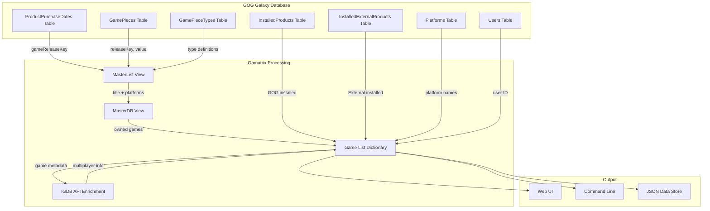
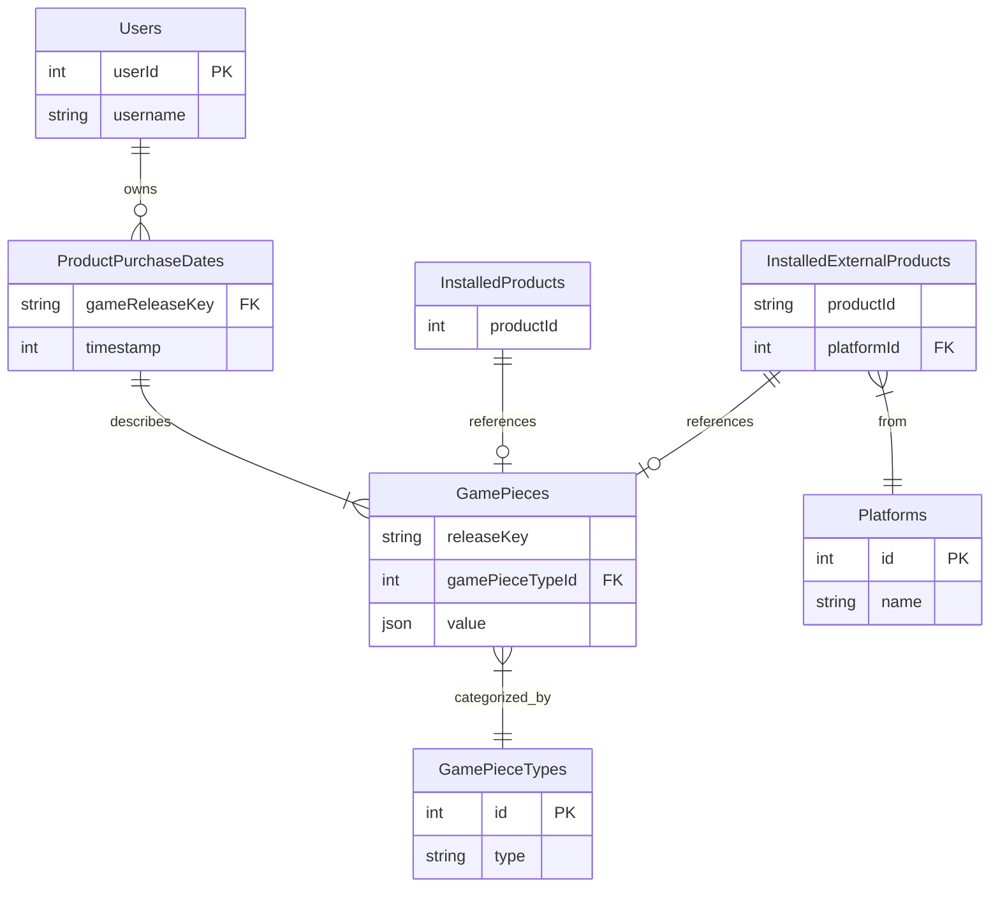

# GOG Galaxy Database Schema Documentation

## Overview

This document describes the GOG Galaxy 2.0 database structure and how Gamatrix extracts game data from it. The GOG Galaxy application stores user game library information in a local SQLite database file, typically located at:

- **Windows**: `C:\ProgramData\GOG.com\Galaxy\storage\galaxy-2.0.db`
- **Linux**: `~/.local/share/GOG.com/Galaxy/storage/galaxy-2.0.db`
- **macOS**: `~/Library/Application Support/GOG.com/Galaxy/storage/galaxy-2.0.db`

## Database Purpose

The GOG Galaxy database aggregates game information from multiple digital distribution platforms (Steam, GOG, Epic Games Store, etc.) through integration plugins. Gamatrix leverages this database to:

1. Identify which games each user owns
2. Determine which games are installed
3. Map games across different platforms
4. Extract game metadata for comparison

## Core Tables Used by Gamatrix

### 1. Users Table

**Purpose**: Stores GOG user account information.

**Key Columns**:
- `userId` (INTEGER, PRIMARY KEY): Unique GOG user identifier
- `username` (TEXT): GOG username

**Usage in Gamatrix**:
```python
# Extract user ID from a GOG database
cursor.execute("select * from Users")
user_id = cursor.fetchone()[0]
```

**Sample Data**:
```
userId  | username
--------|----------
1234567 | JohnDoe
```

---

### 2. GamePieceTypes Table

**Purpose**: Defines the types of game metadata that can be stored in the GamePieces table.

**Key Columns**:
- `id` (INTEGER, PRIMARY KEY): Unique type identifier
- `type` (TEXT): Name of the metadata type

**Important Types for Gamatrix**:
- `originalTitle`: Original game title
- `title`: Display game title
- `allGameReleases`: JSON data containing all platform release keys for a game

**Usage in Gamatrix**:
```python
# Get the type ID for a specific piece type
cursor.execute('SELECT id FROM GamePieceTypes WHERE type="originalTitle"')
type_id = cursor.fetchone()[0]
```

**Sample Data**:
```
id | type
---|------------------
1  | originalTitle
2  | title
3  | allGameReleases
4  | summary
5  | developers
```

---

### 3. GamePieces Table

**Purpose**: Stores game metadata in a key-value structure where each piece of game information is a separate row.

**Key Columns**:
- `releaseKey` (TEXT): Platform-specific game identifier (e.g., `steam_12345`, `gog_67890`)
- `gamePieceTypeId` (INTEGER): Foreign key to GamePieceTypes.id
- `value` (TEXT): JSON-encoded metadata value

**Release Key Format**:
```
{platform}_{game_id}

Examples:
- steam_570       (Dota 2 on Steam)
- gog_1207658924  (The Witcher 3 on GOG)
- epic_catnip     (Some game on Epic)
```

**Usage in Gamatrix**:
```python
# Extract game title for a release key
cursor.execute(f'''
    SELECT value FROM GamePieces 
    WHERE releaseKey="{release_key}" 
    AND gamePieceTypeId={title_type_id}
''')
title_json = cursor.fetchone()[0]
title = json.loads(title_json)["title"]
```

**Sample Data**:
```
releaseKey      | gamePieceTypeId | value
----------------|-----------------|----------------------------------------
steam_730       | 1               | {"title": "Counter-Strike: Global Offensive"}
steam_730       | 3               | {"releases": ["steam_730", "gog_1234567"]}
gog_1207658924  | 1               | {"title": "The Witcher 3: Wild Hunt"}
```

---

### 4. ProductPurchaseDates Table

**Purpose**: Records purchase dates for games, effectively defining which games a user owns.

**Key Columns**:
- `gameReleaseKey` (TEXT): Platform-specific game identifier (links to GamePieces.releaseKey)
- `timestamp` (INTEGER): Unix timestamp of purchase

**Usage in Gamatrix**:
This table is the authoritative source for game ownership. If a game appears here, the user owns it.

```python
# Games in this table = owned games
cursor.execute("SELECT gameReleaseKey FROM ProductPurchaseDates")
```

**Sample Data**:
```
gameReleaseKey  | timestamp
----------------|------------
steam_730       | 1623456789
gog_1207658924  | 1634567890
```

---

### 5. InstalledProducts Table

**Purpose**: Tracks GOG games that are currently installed.

**Key Columns**:
- `productId` (INTEGER): GOG product ID

**Usage in Gamatrix**:
Combined with the `gog_` prefix to create release keys for installed GOG games.

```python
# Get installed GOG games
cursor.execute("SELECT 'gog_' || productId FROM InstalledProducts")
```

**Sample Data**:
```
productId
----------
1207658924
1421404643
```

---

### 6. InstalledExternalProducts Table

**Purpose**: Tracks games from external platforms (Steam, Epic, etc.) that are currently installed.

**Key Columns**:
- `productId` (TEXT): Platform-specific game ID
- `platformId` (INTEGER): Foreign key to Platforms.id

**Usage in Gamatrix**:
Combined with platform name to create release keys for installed non-GOG games.

```python
# Get installed external games
cursor.execute('''
    SELECT platforms.name || '_' || InstalledExternalProducts.productId
    FROM InstalledExternalProducts
    JOIN Platforms ON InstalledExternalProducts.platformId = Platforms.id
''')
```

**Sample Data**:
```
productId | platformId
----------|------------
730       | 2
12345     | 5
```

---

### 7. Platforms Table

**Purpose**: Maps platform IDs to platform names.

**Key Columns**:
- `id` (INTEGER, PRIMARY KEY): Platform identifier
- `name` (TEXT): Platform name (e.g., "steam", "epic", "gog")

**Sample Data**:
```
id | name
---|------
1  | gog
2  | steam
3  | psn
4  | xbox
5  | epic
```

---

## Data Extraction Process

### Step 1: Identify Owned Games

Gamatrix creates temporary views to efficiently query owned games:

```sql
-- Create a master list joining purchase data with game pieces
CREATE TEMP VIEW MasterList AS
    SELECT GamePieces.releaseKey, 
           GamePieces.gamePieceTypeId, 
           GamePieces.value 
    FROM ProductPurchaseDates
    JOIN GamePieces ON ProductPurchaseDates.gameReleaseKey = GamePieces.releaseKey;

-- Create a refined view with titles and platform information
CREATE TEMP VIEW MasterDB AS 
    SELECT DISTINCT(MasterList.releaseKey) AS releaseKey, 
           MasterList.value AS title, 
           PLATFORMS.value AS platformList
    FROM MasterList, MasterList AS PLATFORMS
    WHERE ((MasterList.gamePieceTypeId={title_type_id}) OR 
           (MasterList.gamePieceTypeId={original_title_type_id})) 
      AND ((PLATFORMS.releaseKey=MasterList.releaseKey) AND 
           (PLATFORMS.gamePieceTypeId={all_releases_type_id}))
    ORDER BY title;

-- Get unique games grouped by platform list
SELECT GROUP_CONCAT(DISTINCT MasterDB.releaseKey), MasterDB.title
FROM MasterDB 
GROUP BY MasterDB.platformList 
ORDER BY MasterDB.title;
```

**Result**: A list of tuples containing:
1. Comma-separated release keys (when a game is owned on multiple platforms)
2. JSON-encoded game title

### Step 2: Identify Installed Games

Gamatrix queries both GOG and external platform installations:

```sql
SELECT trim(GamePieces.releaseKey) 
FROM GamePieces
JOIN GamePieceTypes ON GamePieces.gamePieceTypeId = GamePieceTypes.id
WHERE releaseKey IN (
    -- External platform games (Steam, Epic, etc.)
    SELECT platforms.name || '_' || InstalledExternalProducts.productId
    FROM InstalledExternalProducts
    JOIN Platforms ON InstalledExternalProducts.platformId = Platforms.id
    
    UNION
    
    -- GOG games
    SELECT 'gog_' || productId FROM InstalledProducts
)
AND GamePieceTypes.type = 'originalTitle'
```

**Result**: A list of release keys for all installed games.

### Step 3: Build Game List Data Structure

For each database, Gamatrix builds a comprehensive game list:

```python
game_list = {
    "steam_730": {
        "title": "Counter-Strike: Global Offensive",
        "slug": "counter-strike-global-offensive",
        "owners": [1234567, 8901234],  # User IDs
        "installed": [1234567],         # User IDs who have it installed
        "platforms": ["steam"],
        "igdb_key": "steam_730",        # Best key for IGDB lookup
        "multiplayer": True,             # From IGDB or config
        "max_players": 10                # From IGDB or config
    },
    # ... more games
}
```

## Data Flow Diagram



## Entity Relationship Diagram



## Key Data Extracted by Gamatrix

### Per User
- **User ID**: Unique identifier from GOG
- **Username**: Display name (from config)
- **Game Ownership**: List of release keys owned
- **Installation Status**: Which owned games are installed

### Per Game
- **Release Key**: Platform-specific identifier (`platform_id`)
- **Title**: Human-readable game name
- **Slug**: URL-safe version of title
- **Platforms**: List of platforms the game is available on
- **Owners**: List of user IDs who own the game
- **Installed By**: List of user IDs who have it installed
- **IGDB Key**: Best release key for IGDB API lookup (prefers Steam > GOG > others)
- **Multiplayer Support**: Whether game supports multiplayer (from IGDB/config)
- **Max Players**: Maximum player count (from IGDB/config)

### Platform Priority for IGDB Lookups

When a game is owned on multiple platforms, Gamatrix prioritizes:

1. **Steam** (`steam_*`): Most reliable IGDB matches (~90% success rate)
2. **GOG** (`gog_*`): Moderate reliability (~50% success rate)
3. **Other Platforms**: Low reliability, used as fallback

This is why the code searches for Steam keys first in the `allGameReleases` data.

## Data Filtering and Merging

### Duplicate Title Handling

Games owned on multiple platforms by the same users are merged:
- Platforms are combined into a single list
- Highest `max_players` value is retained
- Owner and installation lists are preserved

### Filtering Criteria

Games can be filtered by:
- **Single-player exclusion**: Remove games marked as single-player only
- **Platform exclusion**: Skip games from specific platforms (e.g., exclude Epic)
- **Installation requirement**: Only show games installed by all selected users
- **Common ownership**: Only show games owned by all selected users
- **Exclusive mode**: Only show games NOT owned by certain users

## Performance Considerations

### View-Based Queries
The use of temporary views (`MasterList`, `MasterDB`) optimizes query performance by:
- Reducing redundant joins
- Pre-filtering relevant data
- Enabling efficient grouping and aggregation

### Caching Strategy
Gamatrix caches IGDB API responses to minimize:
- API rate limit impact
- Network latency
- Repeated lookups for the same games

### Multi-Database Processing
When comparing multiple users:
1. Each database is processed sequentially
2. Results are merged in-memory
3. Deduplication happens after all databases are processed

## Sample Data Scenarios

### Scenario 1: User Owns Game on Multiple Platforms

**Database State**:
```
ProductPurchaseDates:
  steam_730, gog_1234567

GamePieces:
  steam_730 | originalTitle | {"title": "CS:GO"}
  steam_730 | allGameReleases | {"releases": ["steam_730", "gog_1234567"]}
  gog_1234567 | originalTitle | {"title": "CS:GO"}
```

**Gamatrix Result**:
```python
{
    "steam_730": {
        "title": "CS:GO",
        "platforms": ["steam", "gog"],
        "igdb_key": "steam_730"  # Steam preferred
    }
}
```

### Scenario 2: Game Installed But Not Owned

If a game appears in `InstalledProducts` or `InstalledExternalProducts` but NOT in `ProductPurchaseDates`, it won't appear in Gamatrix results. Only purchased/owned games are considered.

### Scenario 3: Multiple Users, Different Platforms

**User A owns**: `steam_730`  
**User B owns**: `gog_1234567`

**Gamatrix Result** (common games mode):
```python
{
    "steam_730": {
        "title": "CS:GO",
        "owners": [userA_id, userB_id],
        "platforms": ["steam", "gog"]
    }
}
```

Both users are listed as owners because the game is the same, just on different platforms.

## Related Documentation

- [Sample Scripts](samples/README.md) - Python scripts demonstrating data extraction
- [Configuration Guide](../config-sample.yaml) - How to configure Gamatrix
- [README](../README.md) - Main project documentation

## Troubleshooting

### Database Not Found
Ensure GOG Galaxy is installed and has been run at least once. The database is created on first launch.

### Empty Game List
- Verify the user has games in their GOG Galaxy library
- Check that integrations are connected and synced
- Ensure the database file is not corrupted (try opening with `sqlite3`)

### Missing Game Titles
Some release keys may have null titles, particularly from certain platforms. These are automatically filtered out by Gamatrix.

### IGDB Lookups Failing
- Verify IGDB credentials in config
- Check network connectivity
- Review cache file for stale access tokens

## Conclusion

The GOG Galaxy database provides a rich source of cross-platform game ownership data. Gamatrix efficiently extracts and normalizes this data to enable multi-user game library comparison. Understanding this schema helps with:

- Debugging data extraction issues
- Extending Gamatrix functionality
- Optimizing query performance
- Integrating additional data sources

For hands-on examples of working with this database, see the [sample scripts](samples/README.md).
